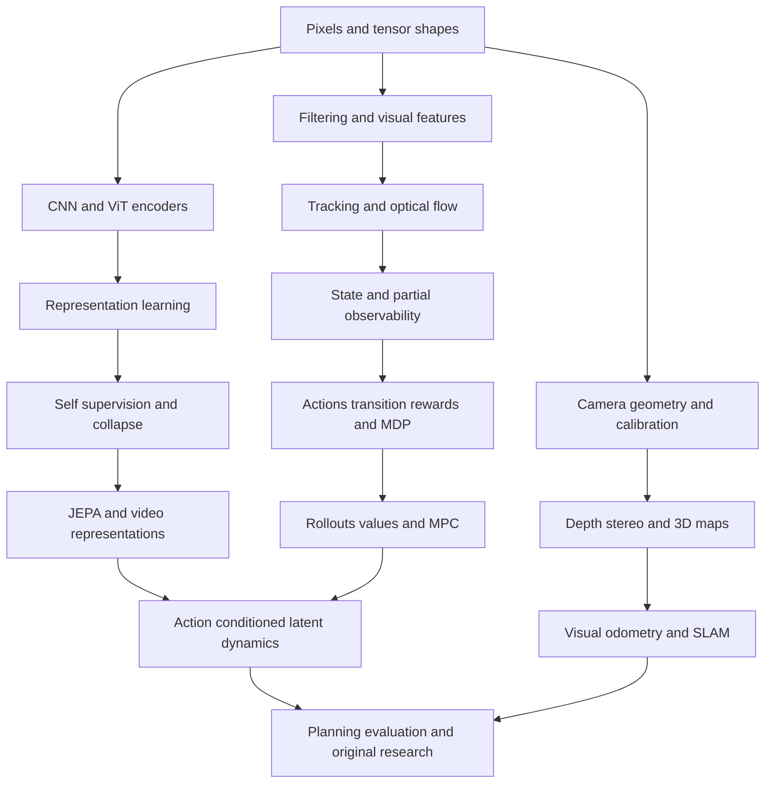

# 1. What is a world model?

Read next: [computer vision](02_opencv_foundations.md). Practical partner: [bouncing ball](../experiments/02_bouncing_ball/README.md).

## ELI5: a tiny rehearsal of what might happen

A ball rolls toward a wall. You expect it to bounce. A dog watches a door open and moves away from its path. A driver brakes before a stopped car. In each case, the useful ability is to connect what is happening now with what could happen next.

A world model is an internal model of an environment that can support such predictions. “World” can mean a tabletop, a game, or a road; it does not require modeling the entire universe. It can be learned from experience or contain known physics. Modern AI discussions usually emphasize learned models.

An image model might identify “glass.” A dynamics model can estimate where that glass will move. A planner compares possible interventions. A controller sends commands that realize an intervention. These are different jobs, even when trained together.

Humans can imagine outcomes, but that analogy is pedagogical. It does not establish that a neural model thinks like a human, has consciousness, or has human common sense.

**Check:** Why is recognizing a moving ball insufficient to catch it?

## ELI10: the glass near the table edge

A robot receives an image. It is a grid of colored numbers, not a complete description of the room.

1. **Capture:** calibrate and timestamp camera frames.
2. **Perceive:** detect glass, table, and robot gripper.
3. **Relate:** estimate glass position relative to edge and gripper.
4. **Track:** compare frames to estimate speed and direction.
5. **Predict:** forecast slide, stop, or fall, including uncertainty.
6. **Consider actions:** move glass inward, block its path, or catch it.
7. **Plan:** compare reachability, time, collision risk, and task cost.
8. **Control:** convert the desired motion into actuator commands.
9. **Observe:** see whether the glass moved as predicted.
10. **Update:** revise the internal estimate and replan.

The robot cannot see friction, exact mass, the glass's center of mass, or occluded surfaces directly. Detecting the edge is perception; estimating unseen properties is state estimation; predicting movement is dynamics; choosing a push is planning.

**Check:** Which missing quantity would make two identical glass images evolve differently?

## ELI15: state, observation, representation, transition

**State** means the information needed to determine future evolution under a chosen modeling assumption. For a ball, position and velocity may suffice. For a glass, contact, shape, mass, friction, and robot configuration may matter.

**Observation** is a measurement: pixels, depth, joint angles, or force readings. Several states can produce the same observation. One image of a ball does not reveal its velocity.

**Representation** is a numerical summary of observations. An encoder is a network that computes this summary. A **latent representation** is learned rather than explicitly labeled as “position” or “friction.” Its coordinates need not have human-readable meanings.

A **transition** is change over time. A predictor learns how a representation changes, often conditioned on actions. Instead of predicting millions of pixels, it might predict a vector with 256 values.

For the glass, an encoder could retain geometry and movement while suppressing irrelevant wallpaper. That is a desired outcome, not something the word “embedding” guarantees. The model might suppress the fine crack that determines whether the glass breaks.

**LLM bridge:** observations resemble context; patch embeddings resemble token embeddings; prediction resembles continuation. The crucial added challenge is that an action changes the environment. A textual continuation is not automatically an intervention model.

**Check:** Can two different-looking scenes have the same useful representation? When would that be harmful?

## ELI18: spatial, temporal, and physical understanding

**Spatial intelligence** concerns relationships in space: inside, behind, reachable, distance, orientation, and navigation. It need not imply accurate forces.

**Temporal understanding** concerns ordering, persistence, speed, and changes. A model that identifies “opening a door” may not forecast how a robot's torque changes its motion.

**Physical reasoning** concerns how objects behave under constraints and interventions. Evaluate it through counterfactual actions, collision consistency, conservation laws where applicable, and successful control—not only attractive video.

A model can forecast embeddings without a renderer. A generative video model can synthesize pixels without explicit metric 3D state. A simulator can be analytical rather than neural. A planner can use a simulator but is not itself the transition model.

The terminology is overloaded. Ha and Schmidhuber's learned model is one influential historical formulation; Li's functional taxonomy distinguishes rendering, simulation, and planning. Use capabilities and tests when comparing systems. [World Models](https://arxiv.org/abs/1803.10122), [functional taxonomy](https://drfeifei.substack.com/p/a-functional-taxonomy-of-world-models).

**Check:** What additional test would you demand before using a video generator for robot training?

## ELI21: the compact formal description

Let time be indexed by (t). Write physical state (s_t), observation (o_t), action (a_t), reward (r_t), encoder (E), and learned dynamics (F):

$$
s_{t+1}\sim p(s_{t+1}\mid s_t,a_t),\quad
o_t\sim p(o_t\mid s_t),\quad
z_t=E(o_{\le t},a_{<t}),\quad
\hat z_{t+1}=F(z_t,a_t).
$$

The symbol $\sim$ means “sampled from.” A conditional probability describes possible outcomes after fixing the variables on its right. History may be necessary because a current image is incomplete. The hat means prediction, not truth.

A decoder (D), if present, generates an observation estimate $\hat o_{t+1}=D(\hat z_{t+1})$. It is optional for embedding-space planning.

A planner chooses an action sequence by optimizing a cost:

$$
a^*_{t:t+H-1}=\arg\min_{a_{t:t+H-1}}
\sum_{k=1}^{H}c(\hat z_{t+k},a_{t+k-1},g).
$$

Here (H) is how far ahead to predict; (g) is a goal; (c) scores undesirable outcomes. The model forecasts; the optimizer searches. Executing the first action and repeating with new observations is model predictive control.

**Check:** Why might a perfect dynamics model still produce a bad action?

## ELI24: interfaces determine what can be learned

Perception, state estimation, dynamics, reward prediction, planning, and control can be separate modules. Dreamer jointly trains a latent model and downstream behavior using imagined experience; JEPA can learn predictive representations before a separate planning stage; a classical robotics system may keep calibrated geometry and known dynamics.

Joint training allows useful feedback across modules but makes failure attribution harder. A single end-to-end loss can hide that a policy ignores its world model. Test this by replacing predictions, removing actions, freezing representations, and measuring changes in control.

A sufficient representation should preserve distinctions relevant to the task. If two states have equal latent codes but require different actions, no policy using only those codes can consistently succeed. History, proprioception, or explicit uncertainty can repair some aliasing.

**Check:** How would you test whether a robot policy actually uses its predicted future?

## ELI27: a falsifiable research definition

Ask five questions of any “world model” claim:

- What environment and intervention class are modeled?
- What is the prediction target and timescale?
- What information is missing from observations?
- On what independent distribution are predictions evaluated?
- Does using the model improve a downstream decision under a fair budget?

Prediction from passive video can exploit correlations. Action conditioning alone does not prove causal identification: demonstrations can confound action choice with hidden circumstances. Interventional coverage and held-out action sequences matter.

A powerful visual representation can improve an existing controller without being an accurate simulator. A renderer can support useful synthetic data without supporting reliable collision checking. There is no single leaderboard that orders every family.

**Check:** Design a situation where low one-step error coexists with poor planning.

## Dependency graph

Geometry is particularly important for robotics and spatial models. It is not a prerequisite for running the small ball predictor. Move through the graph in the order needed for your experiment.
