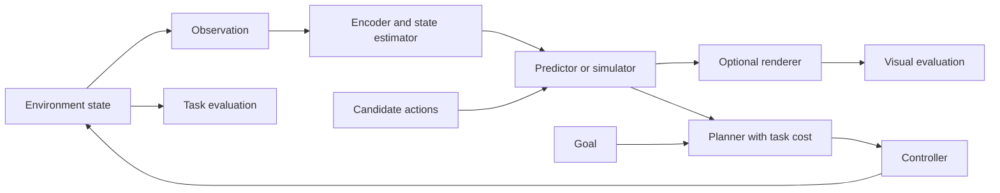

# 4. Taxonomy: compare functions and mechanisms

Previous: [representations](03_representation_learning.md). Next: [architectures](05_architectures.md).

## ELI5–15: three different promises

A drawing shows what a room looks like. A physical model predicts what changes when you move a chair. A route plan tells you how to cross the room. These correspond to rendering, simulation, and planning.

Li's June 3, 2026 essay organizes world models by their outputs: observations for renderers, state for simulators, and actions for planners. This is a functional viewpoint rather than a universal scientific definition. It emphasizes structural fidelity for simulation and the loop connecting the functions. Its claims about the industry's future are a perspective, not independently demonstrated universal conclusions. [Functional taxonomy](https://drfeifei.substack.com/p/a-functional-taxonomy-of-world-models).

A **controller** converts a target or action into actuator signals and handles execution feedback. A planner can choose “move to pose”; a controller generates motor torques. Some learned policies combine both.

**Check:** A product exports a detailed 3D room. What would establish that it models how objects fall?

## ELI18–21: overlapping families

| Family | Input → output | Representation and mechanism | Typical objective | Actions / planning | Evaluation and limitation |
|---|---|---|---|---|---|
| Image/video representation | Images or clips → features | CNN/ViT; masked or view prediction | Contrastive, predictive, or non-contrastive | Often no actions; downstream planning needs added dynamics | Frozen probes, transfer; semantics do not prove control |
| Predictive state | History → future observable statistics | Belief or predictive summary | Forecast likelihood/error | May be action conditioned | Horizon errors; hidden-state aliasing |
| Latent dynamics | Codes + history/actions → next codes | Recurrent or temporal predictor | Latent regression, ELBO, auxiliary tasks | Often yes; MPC or imagined policy learning | Rollouts/control; code can collapse or discard relevant state |
| Generative video | Prompt/history → pixels | Token autoregression or latent denoising | Likelihood, denoising, flow matching | Depends on model and training labels | Video fidelity plus task tests; visual plausibility insufficient |
| Action-conditioned simulator | State/observations + actions → futures | Analytical, learned, or hybrid | System identification / supervised prediction | Explicit interventions | Contact/trajectory/control; coverage and sim-to-real gap |
| Model-based RL system | Observations/actions/rewards → policy | World model plus actor/value functions | Model objective plus return optimization | Imagined rollouts or planning | Return, sample efficiency; model exploitation |
| 3D/spatial model | Views/prompts → geometry/maps | Point clouds, meshes, fields, splats | Geometry, rendering, generative objectives | Camera movement can be modeled; object interaction may not be | Geometry accuracy, consistency; static space is not dynamics |
| Robotics model | Camera/proprioception/actions → futures/actions | Embodiment-specific or general latent state | Prediction and task objectives | Units and timing essential | Real task success; contact and embodiment shift |
| Interactive generative environment | Initial condition + user inputs → streamed frames | Learned persistence and interactive synthesis | Video prediction/interactive training | Restricted action vocabulary often | Persistence, controllability; not calibrated physical simulator |
| Planning-capable composition | Observation + goal → chosen action | Representation + dynamics + cost + optimizer | Multiple training objectives; search at inference | Explicit plan or learned amortized behavior | Success and budget; components can fail independently |

Examples: I-JEPA and V-JEPA for representations; PlaNet and Dreamer for latent-model control; DINO-WM and JEPA-WMs for embedding-space planning; Genie for interactive generation; Cosmos for video-world modeling; Marble for persistent spatial generation. See [source records](references.md) for evidence and dates.

**Check:** Which rows could describe the same system?

## Mechanism is a separate axis

A stochastic pixel-generative model can contain latent dynamics. A JEPA can roll out autoregressively. A world-model-supervised policy can discard its predictor at inference. A classical physics simulator may be better for known rigid-body tasks than a learned video generator.

Use a capability checklist: observation encoding; history/state estimation; metric geometry; action semantics; future prediction; uncertainty; reward/cost; search; execution; feedback. Mark each as implemented, demonstrated, or absent.

## ELI24–27: contracts and scientific tests

If a model promises rendering, test fidelity and view consistency. If it promises simulation, test measurable state dynamics and intervention responses. If it promises planning, test successful actions under uncertainty and a fair interaction budget. If it promises control, measure timing, tracking, stability, and recovery.

Planning is not implied by a predictor. You still need a goal representation, cost, action constraints, optimizer or policy, and execution interface. Conversely, a model-free policy can plan informally in a broad functional taxonomy while never explicitly simulating transitions. State the definition you use.

**Check:** Describe a fair comparison between a video-based planner and a latent planner that accounts for their different inference costs.

