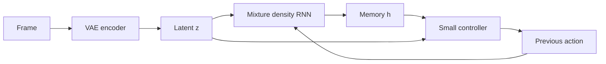
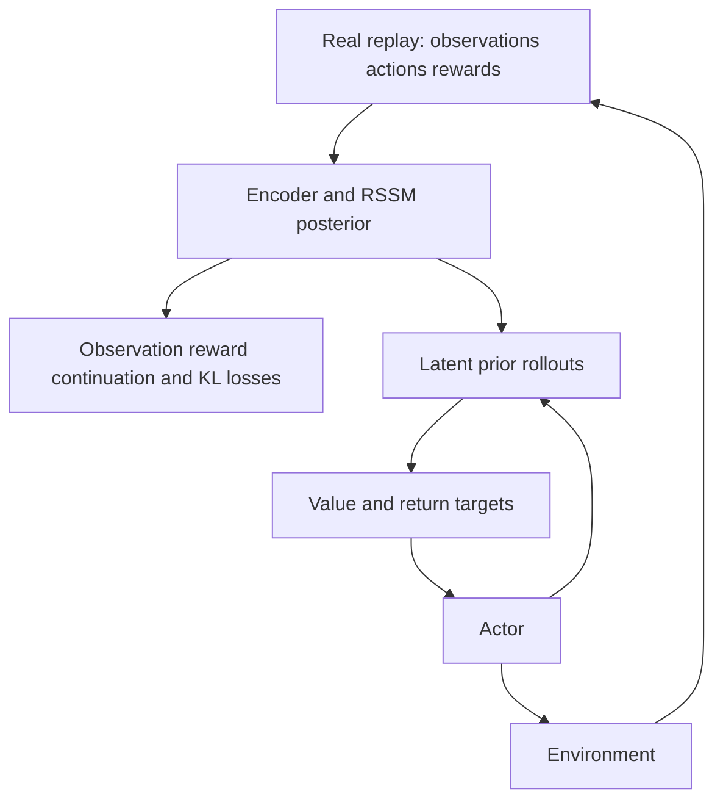
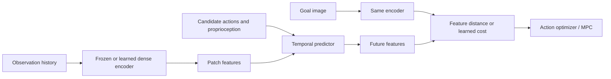
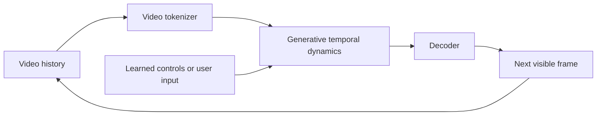
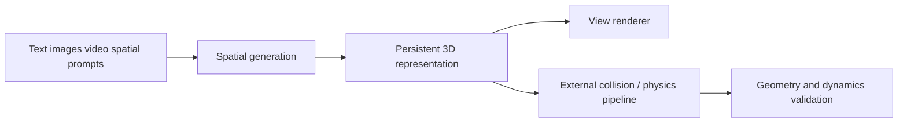

# 5. History, architectures, and reproduction scope

Previous: [taxonomy](04_world_model_taxonomy.md). Next: [JEPA](06_jepa_deep_dive.md). Dates below distinguish first paper submission from later code releases. Bibliographic and resource details are in [references](references.md) and [catalog](08_models_and_datasets.md).

## ELI15: architectural building blocks

An encoder summarizes a measurement. A temporal memory combines measurements across time. A transition predicts change given an action. A decoder renders an output. A reward head scores desirability. A value head estimates longer-term return. A policy chooses actions. An optimizer can search candidate sequences instead of learning a policy.

These pieces answer separate questions: “What is here?”, “What might happen?”, and “What should I do?” Missing observations and stochasticity motivate probability distributions, rather than one fixed hidden vector.

**Check:** Which components are unnecessary for a model used only as a frozen video feature extractor?

## Historical map

| System | First submission/release inspected | Researchers / organization | Main change and demonstrated scope |
|---|---|---|---|
| World Models | March 27, 2018; arXiv v4 May 9 | David Ha, Jürgen Schmidhuber; Google Brain / IDSIA | VAE + recurrent probabilistic model + small evolved controller; game tasks |
| PlaNet | November 12, 2018; later 2019 publication | Hafner, Lillicrap, Fischer, Villegas, Ha, Lee, Davidson | Recurrent state-space model and online latent-space planning from pixels |
| Dreamer | December 3, 2019; v3 March 2020 | Hafner, Lillicrap, Ba, Norouzi | Actor/critic learning from latent imagination |
| DreamerV2 | October 5, 2020; v4 February 2022 | Hafner, Lillicrap, Norouzi, Ba | Discrete stochastic latent state; Atari evaluation |
| DreamerV3 | January 10, 2023; v2 April 2024 | Hafner, Pasukonis, Ba, Lillicrap | Robust multi-domain recipe; original preprint differs from subsequent publication/code |
| I-JEPA | January 19, 2023; v3 April 2023 | Assran et al.; Meta FAIR | Predict masked image-block embeddings |
| V-JEPA | February 15, 2024 recorded on arXiv 2404.08471 | Bardes et al.; Meta FAIR | Masked video feature prediction and downstream representation tests |
| Genie | February 2024 | Bruce et al.; Google DeepMind | Learn latent controls from passive video, interactive generation |
| DINO-WM | November 2024 | Zhou, Pan, LeCun, Pinto | Predict pretrained dense DINO features with action conditioning and planning |
| Genie 2 | December 2024 official announcement | Google DeepMind | Interactive 3D-looking environments; demo rather than open reproduction |
| Cosmos | 2025 family; Predict2.5 late 2025 | NVIDIA research teams | Video foundation models, conditional generation and physical-AI data workflows |
| V-JEPA 2 / 2-AC | June 11, 2025 paper; README records June 25 release | Assran, Bardes et al.; Meta FAIR | Scale video pretraining; additional robot action-conditioned model |
| Genie 3 | August 5, 2025 official announcement | Google DeepMind | Real-time interactive generation; constrained actions and duration |
| Marble | November 12, 2025 product; API January 21, 2026 | World Labs | Persistent explorable spatial worlds; product rather than open training recipe |
| JEPA-WMs | December 30, 2025 | Terver, Yang, Ponce, Bardes, LeCun; Meta/academic collaborators | Study encoder/predictor/objective/planner choices on navigation/manipulation |
| Value-guided JEPA | December 28, 2025; identifier 2601.00844v1 | Destrade, Bounou, Le Lidec, Ponce, LeCun | Shape distances for goal-reaching; small control experiments |
| V-JEPA 2.1 | March 16, 2026 repository release | Mur-Labadia et al.; Meta FAIR | Dense video feature improvements |
| LeWorldModel | March 2026; inspected PDF v3 June 3, 2026 | Maes, Le Lidec, Scieur, LeCun, Balestriero | End-to-end pixel JEPA; next-code prediction plus SIGReg; reported 15M parameters |
| Cosmos 3 | June 2026 search-index record | NVIDIA | Omnimodal family; full paper/checkpoint verification incomplete |
| Semigroup-JEPA | September 9, 2026 | Liu, Sun, Baker, Balestriero, Sous | Physics-parameter conditioning and rollout consistency; preprint |
| V-JEPA Policy | September 29, 2026 | Zhang, Zhao, Fan, Hu, Yuan, Bai, Li | Policy/world-action learning on frozen V-JEPA 2.1 latents; preprint |

Recent entries are candidates for further replication, not an exhaustive claim about all work through October. Several sources expose mutable current pages. See verification limits before choosing weights.

## World Models: compression, memory, and a small controller

**Problem:** pixel input is large; a compact controller needs a useful summary and memory. A VAE encodes frames, an MDN-RNN predicts a distribution of future codes, and a controller consumes the code and recurrent state. A mixture-density network outputs several Gaussian components, accommodating multimodal futures. Training stages separate visual compression, temporal modeling, and control optimization. Demonstrations include CarRacing and a Doom task; these are not general robotics results. [Paper](https://arxiv.org/abs/1803.10122), [project/code](https://worldmodels.github.io/).

Losses include VAE reconstruction/KL and temporal negative log likelihood. The controller is optimized for task reward. Reproduction feasibility is moderate on small games, but environment versions and original framework matter. An accurate latent likelihood can still support an exploitable simulated environment.

**Check:** Why model a distribution rather than a single next code?

## PlaNet: explicit search in a recurrent state-space model

**Problem:** planning from images needs memory and uncertainty. The RSSM has deterministic memory \(h_t\) and stochastic state \(z_t\):
\[
h_{t+1}=f(h_t,z_t,a_t),\quad
p(z_{t+1}|h_{t+1}),\quad
q(z_t|h_t,o_t).
\]
The prior predicts without seeing the next observation; the posterior corrects with actual observations. Decoder and reward heads provide training targets. A variational objective combines observation/reward likelihoods with posterior–prior KL; temporal latent consistency extends supervision over rollouts.

PlaNet uses sampling-based planning, including CEM, to choose action sequences. It replans after receiving feedback. Its pixel-control tasks demonstrate a concrete closed loop, not universal dynamics. [Paper](https://arxiv.org/abs/1811.04551), [code](https://github.com/google-research/planet).

**Check:** When is the posterior available and why is it unavailable during imagination?

## Dreamer family: learn behavior through imagined rollouts

**Problem:** repeatedly searching every action sequence can be costly. Dreamer learns an actor and critic from latent trajectories:
\[
a_t\sim\pi_\psi(a|h_t,z_t),\qquad
V_\xi(h_t,z_t)\approx\mathbb E[\text{future return}].
\]
The world model is trained on real replay; latent imagination supplies behavior-training data. The actor's return objective and the model's prediction objective are different.

DreamerV2 changes stochastic latents to categorical variables and evaluates Atari. DreamerV3 improves robustness across domains with scale-handling and training changes; inspect the chosen paper/code version before copying exact settings. The original 2023/2024 preprint reports 150+ tasks with a fixed recipe. The current official repository is JAX, not PyTorch. [Dreamer](https://arxiv.org/abs/1912.01603), [V2](https://arxiv.org/abs/2010.02193), [V3](https://arxiv.org/abs/2301.04104), [official code](https://github.com/danijar/dreamerv3).

Our experiment 07 is offline learned dynamics plus MPC. It teaches one model-based control path; it does not implement Dreamer's RSSM, actor-critic, replay loop, or pixel-based training.

**Check:** Why is an imagined trajectory useful even without a decoded video?

## JEPA family and DINO-WM

I-JEPA predicts target embeddings from a context block; it is representation learning within images. V-JEPA extends masked feature prediction to video. Neither objective alone makes an action-conditioned simulator. [I-JEPA](https://arxiv.org/abs/2301.08243), [V-JEPA](https://arxiv.org/abs/2404.08471).

V-JEPA 2 combines large video pretraining with an additional action-conditioned robot stage, called V-JEPA 2-AC. An encoder-only checkpoint and an AC predictor are distinct assets. The paper reports video-understanding and robot-planning experiments; the robot demonstrations have limited task and embodiment scope. V-JEPA 2.1 addresses dense feature learning rather than proving general robot control. [V2 paper](https://arxiv.org/abs/2506.09985), [V2.1](https://arxiv.org/abs/2603.14482), [official repository](https://github.com/facebookresearch/vjepa2).

DINO-WM freezes pretrained dense visual features and learns their action-conditioned evolution. It plans toward visual goals by rolling out features; pixel decoding is optional. JEPA-WMs studies choices within this family and provides environment-specific models and reproduced baselines. Do not assume a checkpoint supports a different robot's actions. [DINO-WM](https://arxiv.org/abs/2411.04983), [JEPA-WMs paper](https://arxiv.org/abs/2512.24497).

**Check:** What changes when a pretrained encoder is frozen rather than jointly trained?

## Genie: interactive generation from learned video structure

Genie learns video structure and latent actions without requiring labeled actions in its original passive-video setting. A latent action is a learned control code, not guaranteed to map to robot torque. Later Genie 2/3 public demonstrations show richer interactive environments. Genie 3's official announcement reports 720p generation at 24 FPS and interactions lasting minutes, while acknowledging restricted action space, multi-agent challenges, and limited geographic accuracy. These are provider-reported demonstration capabilities, not our measurements. [Genie paper](https://arxiv.org/abs/2402.15391), [Genie 2](https://deepmind.google/discover/blog/genie-2-a-large-scale-foundation-world-model/), [Genie 3](https://deepmind.google/blog/genie-3-a-new-frontier-for-world-models/).

No independently runnable official training checkpoint was established here. Watching an explorable scene does not reveal whether its internal dynamics are calibrated.

**Check:** How would you validate a generated environment before using it to train navigation?

## Cosmos and spatial models

Cosmos Predict2.5 provides video generation workflows, checkpoints, and adaptation tools under NVIDIA-specific model terms. Video-world prediction can support synthetic data and conditional futures; task accuracy still needs evaluation. Code and weight licenses can differ. A Cosmos 3 search result points to newer work, but direct full-paper fetching failed in this run; its exact capabilities remain provisional. [Predict2.5 paper](https://arxiv.org/abs/2511.00062), [official repository](https://github.com/nvidia-cosmos/cosmos-predict2.5).

Marble generates persistent 3D environments from multimodal inputs, with splat/mesh outputs described by World Labs. A spatial asset can be passed to a separate renderer or physics engine. Persistence and navigability alone do not establish learned dynamic interactions or material parameters. RTFM is a separate real-time frame-generation preview. [Marble product](https://marble.worldlabs.ai/), [World Labs index](https://www.worldlabs.ai/blog).

## ELI27: what “newer” does not answer

Model age is not a capability ordering. A small state predictor can beat a large video model on a calibrated control task. A large video encoder can transfer semantics better than a task-specific state model. Evaluate what matters, under identical observation and action access, not only the headline benchmark.

Unresolved trade-offs include dense versus pooled features, fixed versus learned encoders, stochastic versus deterministic dynamics, pixel reconstruction versus task abstraction, and search versus learned policies. Each requires controlled ablations.

**Check:** Construct a benchmark where a 2018 analytical baseline should beat a 2026 learned world model.
