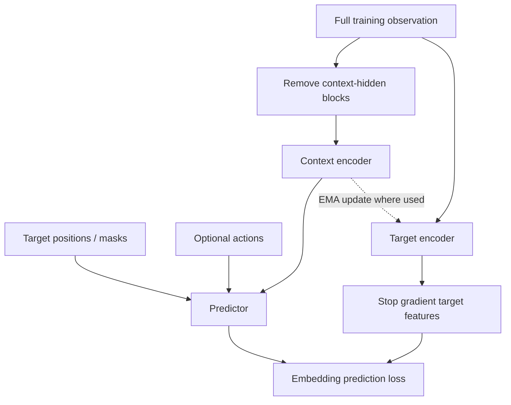

# 6. JEPA, numerical intuition, and value-guided planning

Previous: [architectures](05_architectures.md). Next: [RL and planning](07_rl_and_planning.md).

## ELI5–15: predict the useful summary

The problem is that many future pixels are unpredictable or irrelevant. To catch a ball, its future position matters more than the precise reflection on its surface. A JEPA learns summaries of related observations and predicts one summary from another.

**Joint Embedding Predictive Architecture** describes this framework: observations become embeddings, and a predictor relates them. It is not a specific model size, tokenization method, or robot policy.

A **context encoder** sees available information. A **target encoder** computes the desired representation. A **predictor** estimates the target from context, positions/masks, and sometimes actions. The loss compares embeddings rather than requiring pixel reconstruction.

The desired abstraction is learned, not guaranteed. If color identifies ball mass in training, the representation might exploit color rather than infer motion. Latent prediction can avoid some unpredictable texture detail but can also discard useful detail.

**Check:** What should a glass-moving model preserve even if it need not reconstruct the glass texture?

## ELI18: masked JEPA versus dynamics JEPA

In I-JEPA, context and targets are image regions. In V-JEPA, masks cover spatiotemporal video regions. A context can include later visible frames; masked prediction is not necessarily causal next-frame forecasting. An action-conditioned JEPA instead predicts future representations using actions and permitted history.



A generic loss is
\[
\mathcal L_{\rm pred}=\frac1{|M|}\sum_{j\in M}
\|P_\phi(E_\theta(x_C),m_j,a)-\operatorname{sg}(E_{\bar\theta}(x)_j)\|_p^p.
\]
\(C\) indexes visible context; \(M\) indexes targets; \(m_j\) specifies target position; \(a\) is optional action conditioning; \(\operatorname{sg}\) stops gradients. The choice of norm, masking, normalization, teacher update, and architecture is model-specific. Not every JEPA uses an EMA teacher.

[I-JEPA](https://arxiv.org/abs/2301.08243), [V-JEPA](https://arxiv.org/abs/2404.08471), [V-JEPA 2 official code](https://github.com/facebookresearch/vjepa2).

## Numerical toy flow

Suppose a context encoder returns \(z=[.2,.6]\), action is \(a=[.1]\), and a predictor outputs \(\hat y=[.35,.55]\). The target encoder returns \(y=[.4,.5]\). Mean squared loss is
\[
((.35-.4)^2+(.55-.5)^2)/2=.0025.
\]
With stopped target, \(\partial\mathcal L/\partial\hat y=\hat y-y=[-.05,.05]\). Gradients pass through the predictor and student encoder. If teacher parameter is .50, student parameter .60, and momentum .99, the updated teacher parameter is .501.

These numbers illustrate mechanics only. They do not assign physical meaning to individual embedding coordinates.

```python
target = teacher(next_observation).detach()
prediction = predictor(encoder(observation), action)
loss = (prediction - target).square().mean()
loss.backward()
# optimizer.step(); then EMA update if the selected recipe uses it
```

**Check:** Which branch receives gradients? What would happen if both encoders always output zero?

## ELI21: collapse, invariance, and useful geometry

A constant encoder solves an unconstrained embedding-prediction problem. Avoiding collapse requires architecture/optimization asymmetry or explicit regularization. EMA helps stabilize targets but should not be credited with a blanket proof of non-collapse.

A variance term can penalize features with tiny spread:
\[
v(Z)=d^{-1}\sum_i\max(0,\sigma_0-\sqrt{\operatorname{Var}(Z_i)+\epsilon}).
\]
A covariance penalty suppresses off-diagonal feature correlations. These encourage diversity, not controllability. Predictive and goal-distance geometry can conflict. Measure downstream effects rather than optimizing an attractive eigenspectrum.

Mini-JEPA in this lab uses a two-frame CNN, an EMA target, and explicit variance/covariance regularization. It has no masked-block ViT pretraining. It teaches target prediction and collapse diagnostics, not official V-JEPA performance. [VICReg](https://arxiv.org/abs/2105.04906).

**Check:** Can an uncollapsed representation still be a poor planning space?

## ELI24: mandatory paper record

[Value-guided action planning with JEPA world models, 2601.00844v1](https://arxiv.org/html/2601.00844v1), Matthieu Destrade, Oumayma Bounou, Quentin Le Lidec, Jean Ponce, Yann LeCun. Recorded submission: **December 28, 2025**. Affiliations include École Polytechnique, ENS Paris, and NYU. arXiv describes a World Modeling Workshop 2026 poster. This is a small-control-task study, not a general planning theorem. The paper is CC BY 4.0; this analysis attributes its equations and results.

**Research question:** can training embedding distances to approximate goal-reaching value make them more useful as planning costs?

Prediction alone asks whether future codes are accurate. Planning additionally needs a cost that guides search around obstacles. In a wall world, the straight-line distance to a goal may decrease toward a blocked wall. Reachability-aware distance should instead reflect the path through a door.

### Equation: value as negative distance

\[
V_\theta(s,g)=-\|\mathcal E_\theta(s)-\mathcal E_\theta(g)\|_2.
\]

\(s\): state input, represented by observations in the experiments. \(g\): goal state. \(\mathcal E_\theta\): encoder with weights \(\theta\). The Euclidean norm measures embedding distance. \(V\) is nonpositive: approaching the goal increases value toward zero.

The reaching cost \(C(s,a,g)=\mathbf 1_{s\ne g}\) charges one per non-goal step. Reward is its negative. In a deterministic path requiring \(k\) steps,
\[
V^*(s,g)=-(1+\gamma+\cdots+\gamma^{k-1})
=-\frac{1-\gamma^k}{1-\gamma}.
\]
This is a teaching derivation of discounted reaching cost. It shows why value saturates for distant goals: distances do not remain proportional to undiscounted path length.

### Equation (1): expectile Bellman regression

The paper uses the following sum over trajectory times and sampled goals:
\[
\mathcal L_{\rm VF}^{\theta}
=\sum_{n=0}^{N}\sum_{t=0}^{T-1}
L_\tau^2\left(
-\mathbf 1_{s_t\ne g_n}
+\gamma V_{\bar\theta}(s_{t+1},g_n)
-V_\theta(s_t,g_n)
\right),
\qquad
L_\tau^2(x)=|\tau-\mathbf1_{x<0}|x^2.
\]

- \(T\): trajectory transition count; \(N+1\): goals under the written index convention.
- \(\mathcal D\): dataset of trajectories and goals.
- \(\gamma\): discount factor; \(\tau\): expectile asymmetry.
- \(\mathbf1\): indicator, one when its condition is true.
- \(\bar\theta\): **stop-gradient notation in this equation**, not automatically a separately EMA-updated network.
- \(x\): Bellman residual: observed reward plus discounted next value minus current estimate.

For positive residual \(x\), weight is \(\tau\); for negative residual, weight is \(1-\tau\). At \(\tau=.8\), positive residuals have four times the weight. This favors higher-value continuations present in offline data. It does not search every possible action as a literal maximization over continuous actions would.

Numerical example: current value \(-3\), next value \(-2\), non-goal reward \(-1\), \(\gamma=.98\). Target is \(-2.96\), residual .04, loss \(.8(.04)^2=.00128\). A mean in code differs from the paper's written sum by a scale factor; optimization weights must account for that.

Goals include final trajectory states and random batch states. The method is IQL-inspired value learning; do not substitute a standard Q-network/actor IQL implementation and claim it is identical.

**Check:** Why does the sign convention make minimizing distance equivalent to maximizing value?

### Training, planning, and alternatives

The “Sep” approach trains the state encoder with value loss, then trains action encoder/predictor with prediction loss. Joint variants train both losses together. Baselines include contrastive learning, successive-state distance regression, prediction plus VCReg, and prediction with EMA. Quasimetric variants relax distance symmetry to model directed reachability and add expressivity.

A Euclidean distance is symmetric: \(d(s,g)=d(g,s)\). Goal reaching need not be symmetric, especially with inertia or one-way transitions. Quasimetrics allow asymmetry while imposing structured distance properties. The lab does not implement the paper's quasimetric parameterization.

Planning uses MPC with an MPPI optimizer. MPPI samples perturbations of action sequences, weights them by cost, and updates the candidate sequence. A generic educational form is
\[
w_i\propto \exp(-(J_i-J_{\min})/\lambda),\quad
u\leftarrow u+\sum_iw_i\epsilon_i.
\]
Exact bounds, costs, resampling, and execution settings must follow the official implementation to reproduce a result. MPPI and CEM are different optimizers.

### Environments, architecture, and paper measurements

Wall observations are 64×64 with two channels (agent and walls); WS uses smaller displacement actions and WB larger ones. Each wall dataset contains 1,000 length-64 trajectories, with half passing the door. Maze uses RGB observations plus velocity information to handle inertia; 1,000 length-101 trajectories from five training layouts are reported.

The paper specifies 512-dimensional flat codes, a residual convolutional encoder (2.2M parameters), an MLP predictor (1.3M), identity action encoding, and length-16 training segments. Adam base LR is .0028 with cosine scheduling. Euclidean VF settings are \(\gamma=.98,\tau=.80\); quasimetric settings are \(\gamma=.93,\tau=.60\).

Published planning success rates from Table 2—not our measurements:

| Method | WS | WB | Maze |
|---|---:|---:|---:|
| pred_VCReg | .55 | .89 | .54 |
| pred_EMA | .46 | .43 | .04 |
| VF | .63 | .94 | .49 |
| VF_pred | .55 | .75 | .49 |
| VF_quasi | .71 | .96 | .63 |
| VF_quasi_pred | .61 | .85 | .43 |
| VF_VCReg | .49 | .75 | .39 |

Wall evaluations use 200 instances and maze 80. The appendix reports horizons of 96/64/100 for WS/WB/Maze, with corresponding total planning steps 200/64/200 and MPPI population 2,000 for wall, 500 for maze. Adding prediction or VCReg did not uniformly help. These data support a scoped empirical comparison; the paper's interpretation that quasimetric expressivity helps is not proof that it always helps.

### Pseudocode reconstruction

```text
sample observation trajectories, actions, and final/random goals
initialize encoder and predictor
for representation update:
    compute V(s,g) = -distance(encode(s), encode(g))
    compute stopped Bellman target from s_next and reaching reward
    minimize asymmetric squared residual
    optionally use joint prediction objective (a distinct variant)
for separate predictor update:
    freeze trained representation encoder
    predict encoded next states from current code and action
    minimize prediction error
for each control step:
    encode current observation and goal
    sample/optimize candidate action sequences with MPPI
    roll out latent predictor and score the goal-related cost
    execute the selected initial action, observe, and replan
```

### Limitations and unanswered questions

The paper discusses sparse long-distance constraints, vanishing distant-goal gradients under discounting, dataset coverage, and potential bias in stochastic environments. Only small control worlds are evaluated. Reported success-rate sample counts do not substitute for repeated independent training seeds with confidence intervals.

Questions worth testing: does value shaping help with noisy observations, stochastic contacts, limited action coverage, or changed goals? Does asymmetry help because the problem is directed, or mainly because of added capacity? Can a hierarchy retain long-range task geometry without sacrificing local prediction?

## ELI27: our adaptation and its boundary

Experiment 09 uses one-hot cells in a fixed 7×7 wall grid. It implements the Euclidean value loss and separately fits latent transitions. Its evaluation **uses known transitions with greedy one-step value selection**, isolating representation geometry. It is not full JEPA MPC and does not use its learned transition during planning.

Compared with the paper: different observations, encoder, data coverage, planner, layouts, and scale; no maze inertia, quasimetric, or official checkpoint. Results can falsify claims about this toy geometry, not confirm the paper's reported benchmarks. The next reproduction step is to port image observations, held-out layouts, offline trajectory sampling, and MPPI with frozen configs.

**Check:** Which result would distinguish better goal geometry from better learned dynamics?

