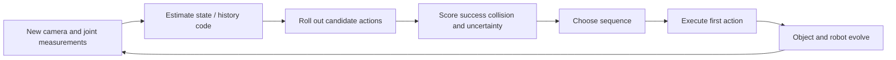

# 7. Reinforcement learning, physics, planning, and control

Previous: [JEPA](06_jepa_deep_dive.md). Next: [resources](08_models_and_datasets.md).

## ELI5–15: picking up an object

A robot sees a cube. It must reach it, close its fingers, and lift. A photograph does not tell it whether the cube is heavy, slippery, fixed to the table, or hidden behind another object.

The **state** includes cube pose, robot joints and velocities, contact state, and relevant physical properties. **Observations** include camera frames and proprioception—measurements of the robot's own configuration. **Actions** might be joint torques, target joint positions, end-effector displacement, or gripper commands. They are not interchangeable; units, frequency, and controller behavior matter.

A **reward** scores desired behavior; a **cost** scores undesirable behavior. Picking the object up can provide a success reward; collision, dropped objects, and excessive force can incur costs. A badly chosen reward can encourage undesired shortcuts.

A **policy** maps available information to an action. A **value function** estimates how much future reward a policy can obtain. A **transition function** describes what changes after an action.

**Check:** Why does an action labeled “move x by .1” need a coordinate frame and unit?

## ELI18: the Markov assumption and hidden state

An MDP is specified by states, actions, transition probabilities, rewards, and discount:
\[
\mathcal M=(\mathcal S,\mathcal A,P,R,\gamma).
\]
“Markov” means the current state captures the past information needed to predict the future. It does not mean the current camera frame is sufficient.

A POMDP adds observations and an observation model. Its **belief state** is a probability distribution over possible states. A Bayesian update has the conceptual form
\[
b_{t+1}(s')\propto p(o_{t+1}|s')
\int p(s'|s,a_t)b_t(s)\,ds.
\]
Predict possible next states using the action, then weight them by agreement with the new measurement. A recurrent encoder approximates this process without explicitly maintaining the full distribution.

For a cube briefly hidden by the gripper, history helps maintain its likely position. A single image may be indistinguishable between successful grasp and an empty gripper.

**Check:** Which two hidden states could produce the same image but require different next actions?

## ELI21: reward and value equations

Discounted return is
\[
G_t=\sum_{k=0}^{\infty}\gamma^k r_{t+k}.
\]
\(0\le\gamma<1\) emphasizes nearer rewards and stabilizes the infinite sum. Finite-horizon tasks can instead stop at a terminal condition.

\[
V^\pi(s)=\mathbb E_\pi[G_t|s_t=s],\qquad
Q^\pi(s,a)=\mathbb E[r_t+\gamma V^\pi(s_{t+1})|s_t=s,a_t=a].
\]
\(V\) scores a state; \(Q\) scores a state–action pair. A goal-conditioned value \(V(s,g)\) additionally depends on the desired outcome.

**Model-free RL** learns policy/value behavior from experience without explicitly learning transitions. **Model-based RL** uses a model to forecast outcomes, improve behavior, or choose actions. An excellent model-free policy can act well without a readable internal simulator.

For pickup, model-free learning can associate observed situations with successful grasp commands. Model-based learning predicts candidate approaches and their consequences, then searches or trains a policy using imagined trajectories.

**Check:** Is behavior cloning from demonstrations automatically model-based RL?

## Rollouts, imagination, and MPC

A rollout applies transitions repeatedly:
\[
\hat s_{k+1}=F_\theta(\hat s_k,a_k).
\]
Real rollouts interact with an environment. Imagined rollouts use a learned model. A forecast may be in latent space rather than pixels.

MPC optimizes a finite sequence, executes an initial part, measures again, and reoptimizes:
\[
\min_{a_{0:H-1}}\sum_{k=0}^{H-1}
c(\hat s_k,a_k)+c_T(\hat s_H,g)
\quad\text{subject to}\quad
\hat s_{k+1}=F_\theta(\hat s_k,a_k),\ a_k\in\mathcal A.
\]
\(c_T\) is a terminal cost; a learned value can represent future consequences beyond the searched horizon. Constraints can encode action limits, collisions, and workspace bounds.

**CEM** samples candidate sequences, keeps the best subset, and fits a new sampling distribution to those elites. **MPPI** uses cost-weighted perturbations. Gradient-based planners differentiate through dynamics. Discrete graph search is appropriate when states/transitions are known and finite. There is no universally best optimizer.

**Check:** Why execute only the initial action when you have already computed the whole sequence?

## Physics: what the toy environments omit

Newtonian point dynamics can use
\[
v_{t+1}=v_t+\Delta t\,F_t/m,\qquad
x_{t+1}=x_t+\Delta t\,v_{t+1}.
\]
This is a discrete integration rule. Contacts add constraints and discontinuities; friction can depend on normal forces and relative motion. Robot arms add kinematics and coupled dynamics:
\[
M(q)\ddot q+C(q,\dot q)\dot q+g(q)=\tau+J(q)^\top f_{\rm contact}.
\]
\(q\) denotes joint angles; \(M\) inertia; \(C\) velocity-dependent effects; \(g\) gravity; \(\tau\) actuator torques; \(J\) maps joint motion to contact-space motion. You need not master all of control theory to run the lab, but a robot dynamics claim must account for such variables or justify its abstraction.

Experiment 02 uses exact elastic reflection of a point inside a box. Experiment 07 uses a damped point robot with acceleration actions. Neither models grasp contacts, rotation, frictional sticking, or real sensors.

**Check:** Why does the analytically exact ball baseline provide no evidence about grasping glass?

## ELI24: uncertainty, offline data, and model exploitation

**Offline training** learns from existing trajectories. **Online interaction** collects new outcomes while learning or deploying. Offline planning is limited by action coverage: the optimizer can propose sequences never seen in training, where predictions may be confidently wrong.

A planner can exploit model inaccuracies: it finds predicted shortcuts rather than physically possible solutions. Penalize uncertain or out-of-support trajectories, add real feedback, and evaluate how often plans leave training support.

Ensemble disagreement is one heuristic:
\[
J=J_{\rm task}+\lambda\sum_k\operatorname{Var}_m[F_m(\hat s_k,a_k)].
\]
The coefficient \(\lambda\) expresses a trade-off; disagreement must be calibrated. Correlated models can fail together.

**Sim-to-real transfer** asks whether simulation-trained behavior survives real sensor, geometry, latency, and physics differences. Domain randomization varies these factors; system identification calibrates them. Neither universally closes the gap.

**Causal prediction** concerns interventions. Demonstration actions depend on hidden goals and scene conditions, so \(p(o'|o,a)\) estimated from demonstrations can be misleading for a new chosen action. Test interventions and vary confounders.

**Check:** Why might a highly accurate predictor on expert demonstrations fail under random robot commands?

## ELI27: scientific design for planning

Measure prediction and control separately, then connect them through ablations. Use identical initial conditions, goal distributions, action bounds, horizons, and feedback access. Include random, no-action, simple analytic/controller, and oracle baselines when possible.

In this lab, the PD controller is a strong baseline on linear point dynamics. If learned MPC only matches it, that is a scoped successful implementation, not proof that learning is necessary. A difficult next experiment introduces obstacles, hidden velocity, or uncertain friction while keeping the test protocol fixed.

**Check:** What extra observation would you give both competing planners to make a partial-observability comparison fair?

